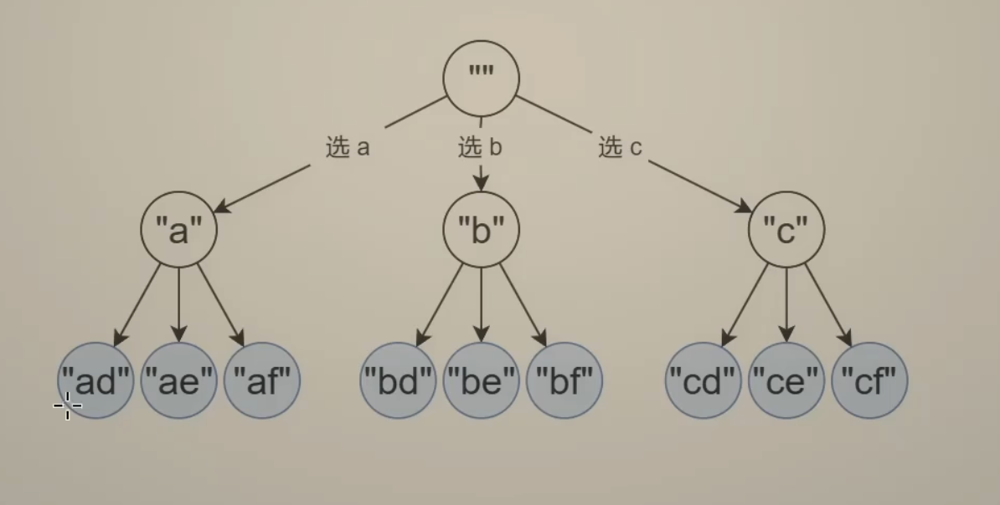
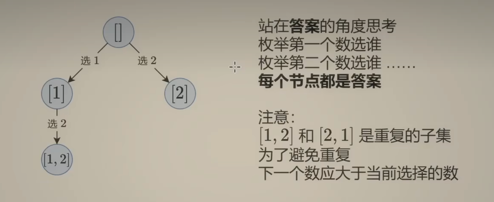

# LeetCode 17. Letter Combinations of a Phone Number
## 题目链接
* [LeetCode 17. Letter Combinations of a Phone Number](https://leetcode.cn/problems/letter-combinations-of-a-phone-number/description/?envType=study-plan-v2&envId=top-100-liked)

## 题目大意
Given a string containing digits from 2-9 inclusive, return all possible letter combinations that the number could represent. Return the answer in any order.

A mapping of digits to letters (just like on the telephone buttons) is given below. Note that 1 does not map to any letters.

Example 1:
```
Input: digits = "23"
Output: ["ad","ae","af","bd","be","bf","cd","ce","cf"]
```

## 解题思路
* 选或不选，每个叶子结点是答案
</img>

* 选哪个作为第i个元素，每个节点都是答案
</img>

## 代码
```python
MAPPING = ["","","abc","def","ghi","jkl","mno","pqrs","tuv","wxyz"]
class Solution:
    def letterCombinations(self, digits: str) -> List[str]:
        n = len(digits)
        if n == 0:
            return []
        ans = []
        path = [""] * n
        def dfs(i):
            if i == n:
                ans.append(''.join(path))
                return
            # traverse char in letters for corresponding number
            for char in MAPPING[int(digits[i])]: 
                path[i] = char
                dfs(i+1)
        dfs(0)
        return ans
```
* Time Complexity: $O(2^n)$, where $n$ is for copy, $2^n$ is for the option is choose or not choose
* Space Complexity: $O(n)$