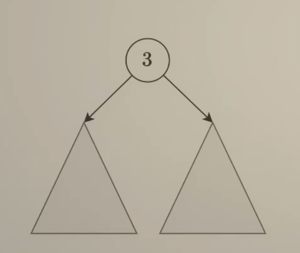

# LeetCode 104. Maximum Depth of Binary Tree
## 题目链接
* [104. Maximum Depth of Binary Tree](https://leetcode.cn/problems/maximum-depth-of-binary-tree/description/?envType=study-plan-v2&envId=top-100-liked)

## 题目大意
A binary tree's maximum depth is the number of nodes along the longest path from the root node down to the farthest leaf node.

Example 1:
```
Input: root = [3,9,20,null,null,15,7]
Output: 3
```
Example 2:
```
Input: root = [1,null,2]
Output: 2
```

## 解题思路
1.分解成子问题（递归：自顶向下递，到达base case后，自下向上归）
</img>

2.遍历二叉树（自顶向下递，在前序位置计算）

3.层序遍历

## 代码
### 思路1: 分解成子问题
```python
class Solution:
    def maxDepth(self, root: Optional[TreeNode]) -> int:
        if root is None:
            return 0
        l_depth = self.maxDepth(root.left)
        r_depth = self.maxDepth(root.right)
        return max(l_depth, r_depth) + 1
```
* Time Complexity: $O(n)$
* Space Complexity: $O(n)$, 最坏情况是，只有左子树（相当于链表），栈帧空间是$n$

### 思路2: 遍历二叉树
```python
class Solution:
    def maxDepth(self, root: Optional[TreeNode]) -> int:
        ans = 0
        def dfs(node, cnt):
            if node is None:
                return
            cnt += 1
            nonlocal ans
            ans = max(ans, cnt)
            dfs(node.left, cnt)
            dfs(node.right, cnt)
        dfs(root, 0)
        return ans
```
* Time Complexity: $O(n)$
* Space Complexity: $O(n)$, 最坏情况是，只有左子树（相当于链表），栈帧空间是$n$

### 思路3: 层序遍历
```python

```