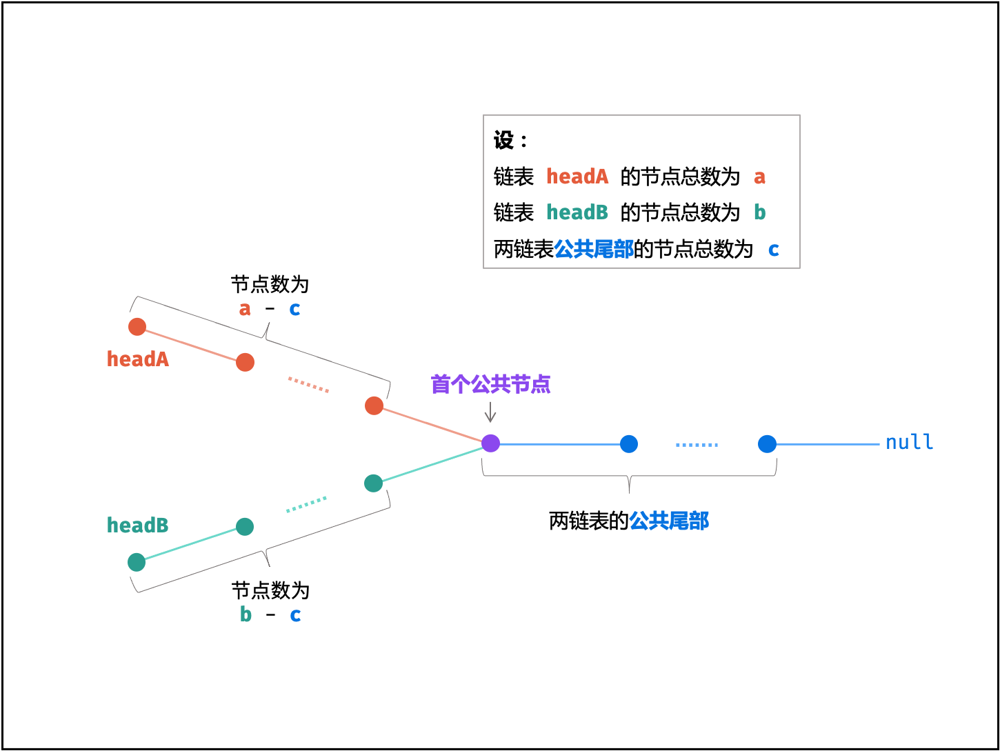

# LeetCode 160. Intersection of Two Linked Lists
## 题目链接
* [LeetCode 160. Intersection of Two Linked Lists](https://leetcode.cn/problems/intersection-of-two-linked-lists/?envType=study-plan-v2&envId=top-100-liked)

## 题目大意
See in the LeetCode

## 解题思路
</img>

* a + (b - c) = b + (a - c)

* Pointer A, B traverses linked list A, B respectively, then traverses linked list B, A reversely

## 代码
```python
class Solution:
    def getIntersectionNode(self, headA: ListNode, headB: ListNode) -> Optional[ListNode]:
        A = headA
        B = headB

        while A != B:
            A = A.next if A else headB
            B = B.next if B else headA
        
        return A
```
* Time Complexity: $O(a+b)$, 最差情况下（即 ∣a−b∣=1|a - b| = 1∣a−b∣=1 , c=0c = 0c=0 ），此时需遍历 a+ba + ba+b 个节点
* Space Complexity: $O(1)$