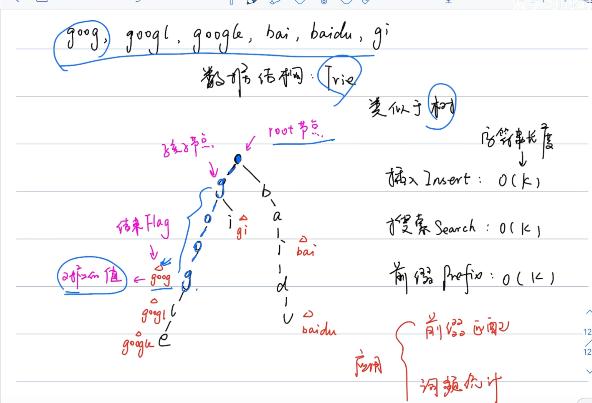

# LeetCode 208. Implement Trie (Prefix Tree)
## 题目链接
* [LeetCode 208. Implement Trie (Prefix Tree)](https://leetcode.cn/problems/implement-trie-prefix-tree/description/?envType=study-plan-v2&envId=top-100-liked)

## 题目大意
A trie (pronounced as "try") or **prefix tree** is a tree data structure used to efficiently store and retrieve keys in a dataset of strings. There are various applications of this data structure, such as autocomplete and spellchecker.

Implement the Trie class:

* Trie() Initializes the trie object.
* void insert(String word) Inserts the string word into the trie.
* boolean search(String word) Returns true if the string word is in the trie (i.e., was inserted before), and false otherwise.
* boolean startsWith(String prefix) Returns true if there is a previously inserted string word that has the prefix prefix, and false otherwise.
 

Example 1:
```python
Input
["Trie", "insert", "search", "search", "startsWith", "insert", "search"]
[[], ["apple"], ["apple"], ["app"], ["app"], ["app"], ["app"]]
Output
[null, null, true, false, true, null, true]

Explanation
Trie trie = new Trie();
trie.insert("apple");
trie.search("apple");   // return True
trie.search("app");     // return False
trie.startsWith("app"); // return True
trie.insert("app");
trie.search("app");     // return True
```

## 解题思路
Trie 的每个节点存储了对其子节点的链接（通常是数组或哈希表），每个节点代表一个字符。根节点不包含字符，除根节点外的每个节点都与一个字符相关联。除此之外，节点通常还包含一个标志，表示该节点是否是某个字符串的结束。

</img>

## 代码
```python
class Trie:
    def __init__(self):
        # 初始化根节点，使用字典存储子节点，布尔值标记是否为单词的结尾
        self.children = {}
        self.is_end_of_word = False

    def insert(self, word: str) -> None:
        # 从根节点开始插入
        current = self
        for char in word:
            # 如果当前字符不在子节点中，创建新的 Trie 实例作为节点
            if char not in current.children:
                current.children[char] = Trie()
            current = current.children[char]
        # 设置单词结束标志
        current.is_end_of_word = True

    def search(self, word: str) -> bool:
        # 从根节点开始搜索
        current = self
        for char in word:
            # 如果当前字符不在子节点中，返回 False
            if char not in current.children:
                return False
            current = current.children[char]
        # 返回是否有单词结束标志，针对前缀
        return current.is_end_of_word

    def startsWith(self, prefix: str) -> bool:
        # 从根节点开始搜索前缀
        current = self
        for char in prefix:
            # 如果当前字符不在子节点中，返回 False
            if char not in current.children:
                return False
            current = current.children[char]
        # 只要能走完前缀就返回 True
        return True
```
* Time Complexity: $O(n)$, where $n$ is the length of string
* Space Complexity: $O(n*m)$, 最坏情况下，如果所有输入字符串互不相同，空间复杂度为 O(m∗n)O(m * n)O(m∗n)，其中 m 是插入的键数，n 是平均字符串长度
