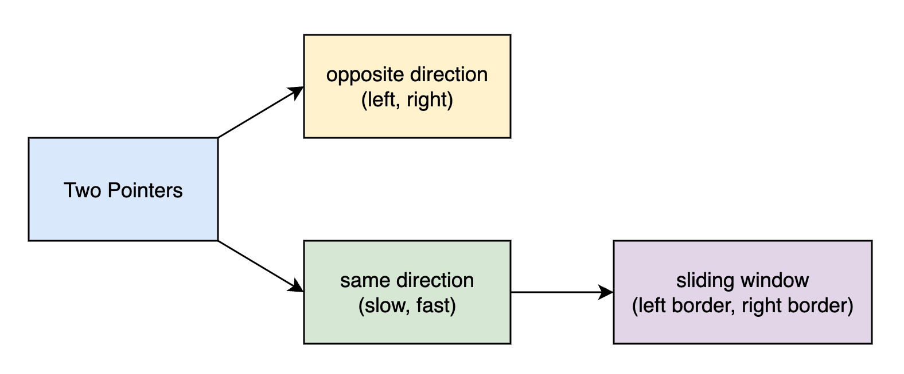

# LeetCode-Notes
Notes for MLE tech interviews, including 剑指Offer, Hot100, and NeetCode75

* 剑指Offer [2/66]
* Hot100 [11/100]
* NeetCode [/75]

## Hash
* [剑指 Offer 03. 数组中重复的数字](剑指Offer/剑指Offer03.数组中重复的数字.md)
* [LeetCode 001. Two Sum](Hot100/LeetCode001.TwoSum.md)

## Two Pointers
</img>

**opposite direction**
* [LeetCode 011. Container With Most Water](Hot100/LeetCode011.ContainerWithMostWater.md)
* [LeetCode 015. Three Sum](Hot100/LeetCode015.ThreeSum.md)
* [LeetCode 042. TrappingRainWater](Hot100/LeetCode042.TrappingRainWater.md)

**same direction**
* [LeetCode 160. Intersection of Two Linked Lists](Hot100/LeetCode160.IntersectionofTwoLinkedLists.md)

**sliding window**
* [LeetCode 003. Longest Substring Without Repeating Characters](Hot100/LeetCode003.LongestSubstringWithoutRepeatingCharacters.md)

## Tree/Recursion
* [LeetCode 104. Maximum Depth of Binary Tree](Hot100/LeetCode104.MaximumDepthofBinaryTree.md)
* [LeetCode 101. Symmetric Tree](Hot100/LeetCode101.SymmetricTree.md)
* [LeetCode 017. Letter Combinations of a Phone Number](Hot100/LeetCode017.LetterCombinationsofaPhoneNumber.md)

## Sort
**Quick Sort**
* [LeetCode 215. Kth Largest Element in an Array](Hot100/LeetCode215.KthLargestElementinanArray.md)

**Merge Sort**
* [剑指 Offer 51. 逆序对](剑指Offer/剑指Offer51.逆序对.md)

## Graph
* [LeetCode 208. Implement Trie (Prefix Tree)](Hot100/LeetCode208.ImplementTrie.md)