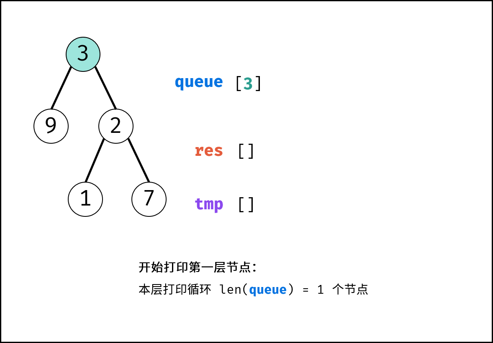
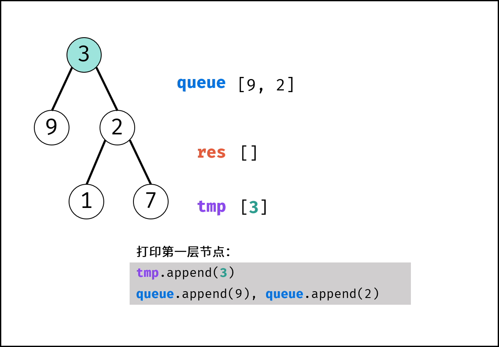
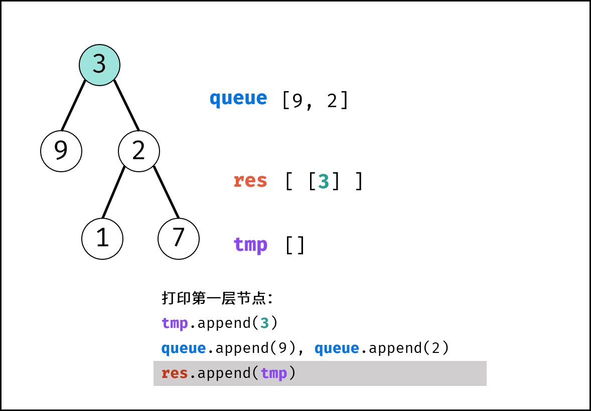

# Template

## Sliding Window
```python

```

## 
**Binary Tree Node**
```python
class TreeNode:
    def __init__(self, val=0, left=None, right=None):
        self.val = val
        self.left = left
        self.right = right
```

**Multiway Tree Node**
```python
class TreeNode:
    def __init__(self, val=0):
        self.val = val
        self.children = []
```

## DFS(recursion)
**Preorder Traversal**
```python
def preorderTraversal(root):
    res = []
    def dfs(node):
        if node is None:
            return
        nonlocal res
        res.append(node.val)
        dfs(node.left)
        dfs(node.right)
    dfs(root)
    return res
```
```python
def preorderTraversal(root):
    if root is None:
        return []
    l = preorderTraversal(root.left)
    r = preorderTraversal(root.right)
    return [root.val] + l + r
```

**Inorder Traversal**
```python
def inorderTraversal(root):
    res = []
    def dfs(node):
        if node is None:
            return
        nonlocal res
        dfs(node.left)
        res.append(node.val)
        dfs(node.right)
    dfs(root)
    return res
```
```python
def inorderTraversal(root):
    if root is None:
        return []
    l = preorderTraversal(root.left)
    r = preorderTraversal(root.right)
    return  l + [root.val] + r
```

**Postorder Traversal**
```python
def postorderTraversal(root):
    res = []
    def dfs(node):
        if node is None:
            return
        nonlocal res
        dfs(node.left)
        dfs(node.right)
        res.append(node.val)
    dfs(root)
    return res
```
```python
def postorderTraversal(root):
    if root is None:
        return []
    l = preorderTraversal(root.left)
    r = preorderTraversal(root.right)
    return  l + r + [root.val]
```

## BFS(iteration)
**Level Order Traversal**
</img>
</img>
</img>
```python
def levelorder(root):
    if root is None:
        return []
    res = []
    queue = collections.deque()
    queue.append(root) # initialize queue
    while queue:
        tmp = []
        for _ in range(len(queue)):
            node = queue.popleft()
            tmp.append(node.val) # update tmp
            # update queue
            if node.left: queue.append(node.left)
            if node.right: queue.append(node.right)
        res.append(tmp) # update res
    return res
```