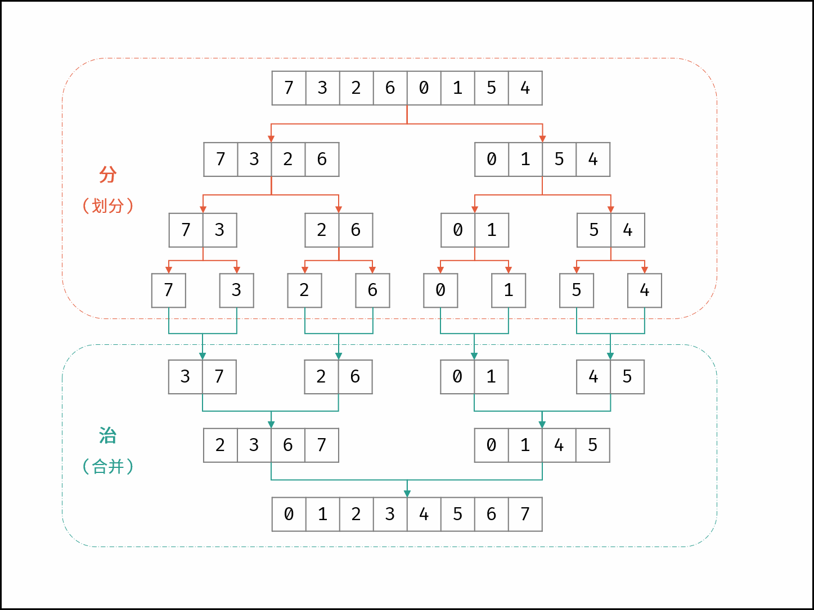

# 剑指Offer51.逆序对
## 题目链接
* [剑指 Offer 51. 数组中的逆序对 - 力扣](https://leetcode.cn/problems/shu-zu-zhong-de-ni-xu-dui-lcof/)

## 题目大意
**描述**：给定一个数组 `nums`。

**要求**：计算出数组中的逆序对的总数。

**说明**：

* 逆序对：在数组中的两个数字，如果前面一个数字大于后面的数字，则这两个数字组成一个逆序对。
* 0 $\le$ nums.length $\le$ 500000。

**示例**：
```
输入: [7,5,6,4]
输出: 5
```

## 解题思路
1.滑动窗口（超时）

2.归并排序merge sort，在合并的过程中计算逆序对

<center>
</img>
</center>

## 代码
### 思路1：滑动窗口
```python
class Solution:
    def reversePairs(self, record):
        l = 0
        r = 1
        cnt = 0
        for l in range(len(record)):
            r = l + 1
            while r < len(record):
                if record[l] > record[r]:
                    cnt += 1
                r += 1
                
        return cnt
    

if  __name__=='__main__':
    record = [9, 7, 5, 4, 6]
    solution = Solution()

    cnt = solution.reversePairs(record)
    print(cnt)
```
* Time Complexity: $O(n^2)$, where $n$ is the number of elements in the list `nums`
* Space Complexity: $O(1)$


### 思路2: 归并排序
```python
class Solution:
    def reversePairs(self, record):
        return self.merge_sort(record, 0, len(record) - 1)
    
    def merge_sort(self, nums, left, right):
        if left >= right:
            return 0
        
        mid = (left + right) // 2
        cnt_l = self.merge_sort(nums, left, mid)
        cnt_r = self.merge_sort(nums, mid + 1, right)

        cnt_c = self.merge(nums, left, mid, right)

        return cnt_l + cnt_r + cnt_c
    
    def merge(self, nums, left, mid, right):
        tmp = [0] * (right - left + 1)
        cnt = 0
        i, j, k = left, mid + 1, 0

        while i <= mid and j <= right:
            if nums[i] <= nums[j]:
                tmp[k] = nums[i]
                i += 1
            else:
                tmp[k] = nums[j]
                j += 1
                cnt += (mid - i + 1) # count the reverse pair
            k += 1
        
        while i <= mid:
            tmp[k] = nums[i]
            i += 1
            k += 1
        while j <= right:
            tmp[k] = nums[j]
            j += 1
            k += 1
        
        for k in range(len(tmp)):
            nums[left + k] = tmp[k]

        return cnt


if __name__ == '__main__':
    record = [9, 7, 5, 6, 4]
    solution = Solution()
    
    cnt = solution.reversePairs(record)
    print(cnt)
    print(record)

```

* Time Complexity: $O(nlogn)$, where $n$ is the number of elements in the list `nums`
* Space Complexity: $O(n)$, `tmp` 占用 $O(N)$ 大小的额外空间